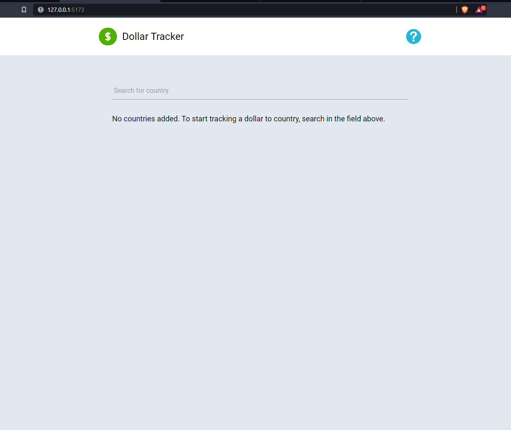
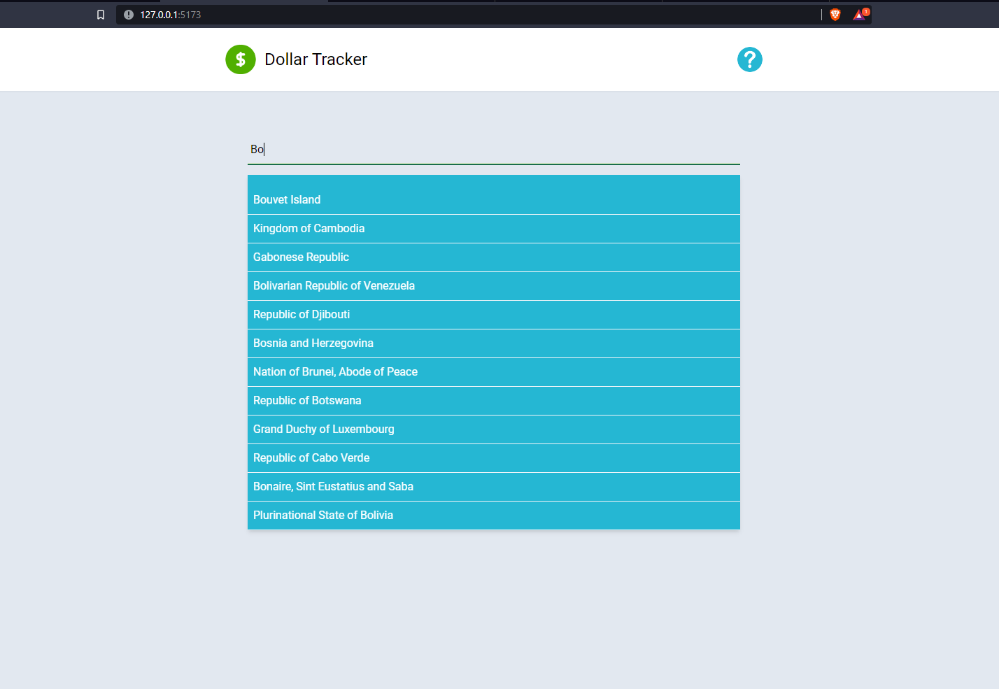
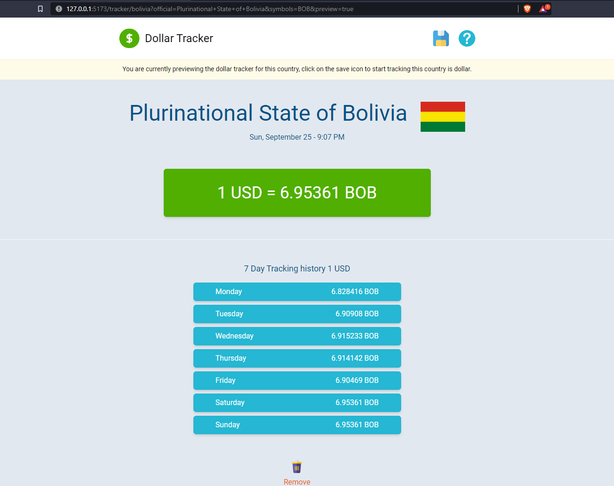
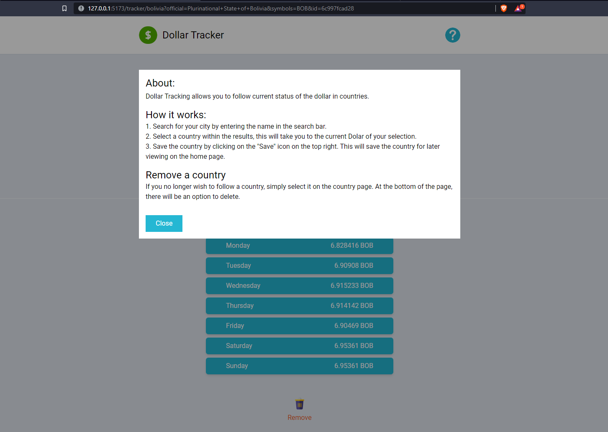
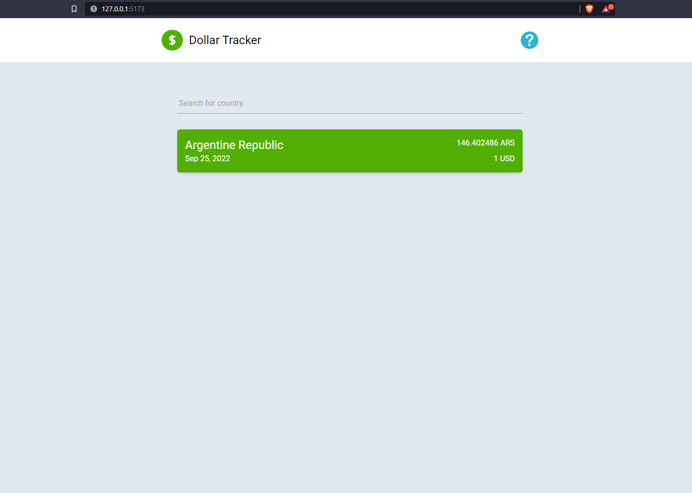
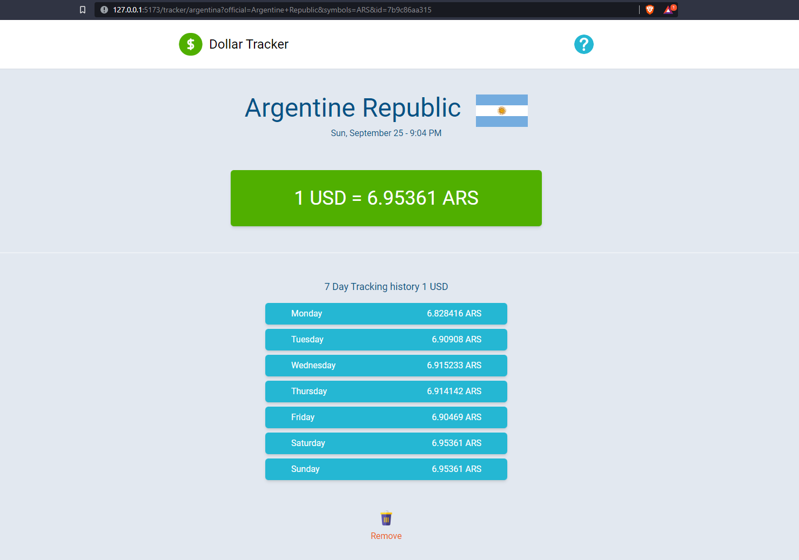

# Dollar Tracker app

The application helps us to follow the exchange rate in different countries.

## Recommended IDE Setup

[VSCode](https://code.visualstudio.com/) + [Volar](https://marketplace.visualstudio.com/items?itemName=Vue.volar) (and disable Vetur) + [TypeScript Vue Plugin (Volar)](https://marketplace.visualstudio.com/items?itemName=Vue.vscode-typescript-vue-plugin).

## Customize configuration

More information [Vite Configuration Reference](https://vitejs.dev/config/).

## Project Setup

```sh
npm install
```

### Compile and Hot-Reload for Development

##### Mode Dev
To activate the dev mode we need to have configured env for dev.

You need to create an account free to get key [exchangeratesapi](https://exchangeratesapi.io/)

You need create file with name: .env

```sh
VITE_MODE=DEV
VITE_EXCHANGE_API_KEY=xxxxxxxxxxx
```

```sh
npm run dev
```

##### Mode Mock
To active the Mock mode we need to have env.mock configured. Mock mode will only raise the basic functions for dollar tracking calls and will start using dummy data.

You need create file with name: .env.mock

```sh
VITE_MODE=MOCK
VITE_EXCHANGE_API_KEY=MOCK
```


```sh
npm run mock
```

### Compile and Minify for Production

```sh
npm run build
```

### ScreenShot











